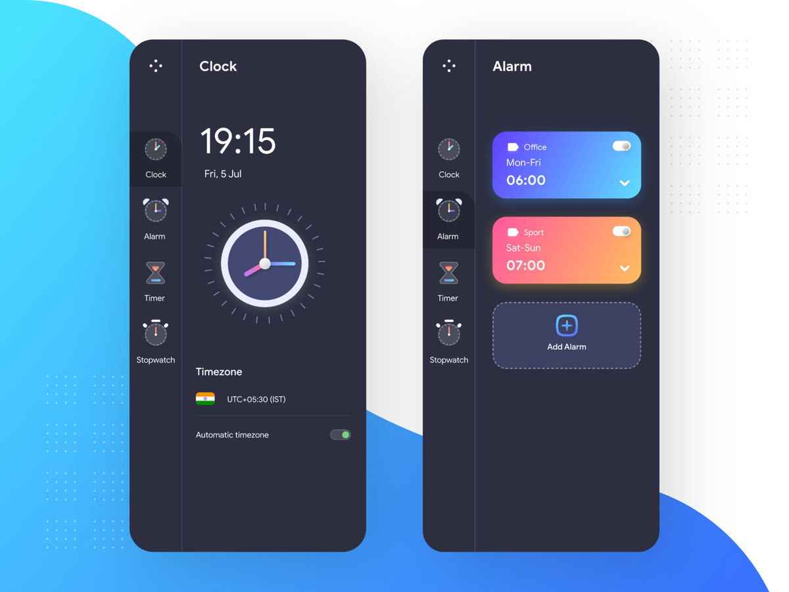

# Flutter Clock App
Minimal UI | Modern Theme | Full Functional

  

Flutter Local Notification Tutorial | Clock App (Episode-5)
https://youtu.be/iKxrt4ASR5Y

Flutter ListView Tutorial | Clock App (Episode-4)
https://youtu.be/tKtYfuuVHlA

Flutter Navigation with Provider || Clock App (Episode-3)
https://youtu.be/WMp5FnQ1X_g

Flutter Design Tutorial || Clock App (Episode-2)
https://youtu.be/MPc-K8oEbdE

Flutter Custom Painter Tutorial || Clock App (Episode-1)
https://youtu.be/HyAeZKWWuxA

If you like my work, support me to create more! 

## Getting Started

This project is a starting point for a Flutter application.

A few resources to get you started if this is your first Flutter project:

- [Lab: Write your first Flutter app](https://flutter.dev/docs/get-started/codelab)
- [Cookbook: Useful Flutter samples](https://flutter.dev/docs/cookbook)

For help getting started with Flutter, view our
[online documentation](https://flutter.dev/docs), which offers tutorials,
samples, guidance on mobile development, and a full API reference.
